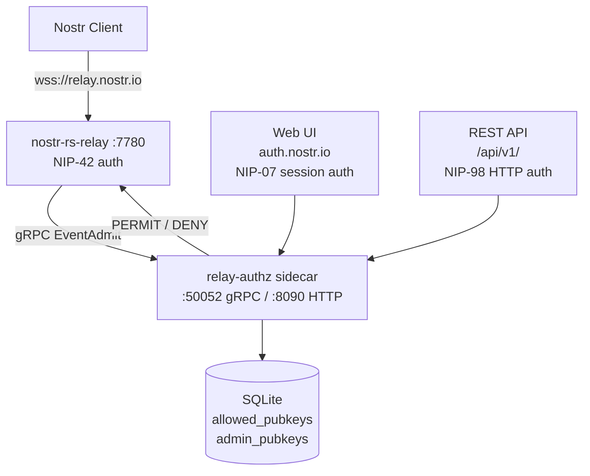

# relay.nostr.io

> **AI Agents**: A deployment and operations skill is available at `skills/relay-nostr-io/`. Load `skills/relay-nostr-io/SKILL.md` for structured guidance on building, deploying, configuring, and operating this system. The skill includes reference documents for the full deployment walkthrough, API usage with nak examples, and admin/web UI setup.

An authenticated Nostr relay with a dynamic authorization system. A single Go binary (`relay-authz`) serves both a gRPC sidecar for [nostr-rs-relay](https://sr.ht/~gheartsfield/nostr-rs-relay/) event admission and an HTTP admin interface for managing the pubkey allow list in real time.

The relay enforces [NIP-42](https://github.com/nostr-protocol/nips/blob/master/42.md) authentication on all writes. Only pubkeys present in the allow list may publish events. Administrators manage the allow list through either a web UI (authenticated via NIP-07 browser extensions) or a REST API (authenticated via [NIP-98](https://github.com/nostr-protocol/nips/blob/master/98.md) HTTP Auth).

## Architecture



When a client publishes an event to `wss://relay.nostr.io`, nostr-rs-relay extracts the client's NIP-42 authenticated pubkey and calls the `EventAdmit` gRPC method on the sidecar. The sidecar checks whether that pubkey exists in the `allowed_pubkeys` table and returns PERMIT or DENY.

### Port Allocation

| Service | Port | Binding |
|---------|------|---------|
| nostr-rs-relay (WebSocket) | 7780 | 0.0.0.0 |
| relay-authz gRPC | 50052 | [::1] |
| relay-authz HTTP | 8090 | 127.0.0.1 |

The HTTP interface is reverse-proxied to `https://auth.nostr.io`.

## Web UI

The admin dashboard at `https://auth.nostr.io` provides a browser-based interface for managing the allow list. Authentication uses NIP-07 (browser extension signing).

### Auth Flow

1. Admin navigates to `https://auth.nostr.io`
2. The login page calls `POST /api/auth/challenge` with the admin's hex pubkey
3. The server returns an unsigned kind-22242 event with a random challenge tag
4. The browser extension signs the event via `window.nostr.signEvent()`
5. The signed event is sent to `POST /api/auth/verify`
6. On success, a session cookie (`relay_session`, 24h TTL) is set
7. The admin is redirected to `/dashboard`

### Dashboard

The dashboard displays the full allow list and provides controls to add or remove npubs. The UI uses htmx for partial page updates without full reloads.

## REST API

The `/api/v1/` endpoints provide programmatic access to the allow list. All requests require a NIP-98 `Authorization` header.

### NIP-98 Authentication

Every API request must include an `Authorization` header containing a base64-encoded, signed kind-27235 Nostr event with `u` (URL) and `method` tags matching the request. The event must be signed by an admin pubkey and its timestamp must be within 60 seconds of the server's clock.

Header format:
```
Authorization: Nostr <base64(signed-kind-27235-event)>
```

### Endpoints

#### List allowed pubkeys

```
GET /api/v1/pubkeys
```

Returns a JSON array of allowed pubkey entries:

```json
[
  {
    "hex_pubkey": "1756c40fddc3851f...",
    "npub": "npub1zatvgr7acwz37...",
    "note": "spindle test keypair",
    "added_by": "25e82904f0b655ac...",
    "added_at": "2026-03-07T15:09:23Z"
  }
]
```

#### Add an npub to the allow list

```
POST /api/v1/pubkeys
Content-Type: application/json

{"npub": "npub1...", "note": "optional description"}
```

Returns `201 Created` with the created entry:

```json
{
  "npub": "npub1...",
  "note": "optional description",
  "added_by": "25e82904f0b655ac..."
}
```

#### Remove a pubkey from the allow list

```
DELETE /api/v1/pubkeys/{hex}
```

Returns:

```json
{"ok": true}
```

### Using the API with nak

[nak](https://github.com/fiatjaf/nak) (the Nostr Army Knife) can generate the NIP-98 auth events needed for API calls.

#### List pubkeys

```bash
NIP98_EVENT=$(nak event \
  --sec <your-admin-nsec> \
  -k 27235 -c "" \
  --tag u="https://auth.nostr.io/api/v1/pubkeys" \
  --tag method=GET)

curl -s "https://auth.nostr.io/api/v1/pubkeys" \
  -H "Authorization: Nostr $(echo -n "$NIP98_EVENT" | base64 -w0)" | jq .
```

#### Add an npub

```bash
NIP98_EVENT=$(nak event \
  --sec <your-admin-nsec> \
  -k 27235 -c "" \
  --tag u="https://auth.nostr.io/api/v1/pubkeys" \
  --tag method=POST)

curl -s -X POST "https://auth.nostr.io/api/v1/pubkeys" \
  -H "Authorization: Nostr $(echo -n "$NIP98_EVENT" | base64 -w0)" \
  -H "Content-Type: application/json" \
  -d '{"npub":"npub1...","note":"description"}' | jq .
```

#### Remove a pubkey

```bash
HEX="<hex-pubkey-to-remove>"

NIP98_EVENT=$(nak event \
  --sec <your-admin-nsec> \
  -k 27235 -c "" \
  --tag u="https://auth.nostr.io/api/v1/pubkeys/${HEX}" \
  --tag method=DELETE)

curl -s -X DELETE "https://auth.nostr.io/api/v1/pubkeys/${HEX}" \
  -H "Authorization: Nostr $(echo -n "$NIP98_EVENT" | base64 -w0)" | jq .
```

#### Publish to the relay with NIP-42 auth

Once an npub is on the allow list, publish events using nak's `--auth` flag:

```bash
nak event \
  --sec <your-nsec> \
  -c "Hello from relay.nostr.io" \
  --auth \
  wss://relay.nostr.io
```

## Session-Authenticated Web Endpoints

These endpoints are used by the web UI and require a valid `relay_session` cookie (set via the NIP-07 auth flow).

| Method | Path | Description |
|--------|------|-------------|
| `GET` | `/` | Login page (redirects to `/dashboard` if session exists) |
| `POST` | `/api/auth/challenge` | Generate NIP-07 challenge event |
| `POST` | `/api/auth/verify` | Verify signed challenge, create session |
| `POST` | `/api/auth/logout` | Clear session |
| `GET` | `/dashboard` | Admin dashboard |
| `GET` | `/api/pubkeys` | List pubkeys (htmx partial) |
| `POST` | `/api/pubkeys` | Add npub (form: `npub`, `note`) |
| `DELETE` | `/api/pubkeys/{hex}` | Remove pubkey |

## Deployment

### Prerequisites

- A Linux server (Ubuntu or similar) with systemd
- [nostr-rs-relay](https://sr.ht/~gheartsfield/nostr-rs-relay/) binary at `/usr/local/bin/nostr-rs-relay`
- A reverse proxy (nginx, caddy, etc.) routing `wss://relay.nostr.io` to port 7780 and `https://auth.nostr.io` to port 8090
- `sqlite3` CLI (for manual database inspection)

### Create the service user and directories

```bash
useradd -r -s /usr/sbin/nologin nostr
mkdir -p /var/lib/relay.nostr.io /etc/relay.nostr.io
chown nostr:nostr /var/lib/relay.nostr.io
```

### Install the binaries

Build locally (see [Building](#building)) and copy to the server:

```bash
scp bin/relay-authz root@your-server:/usr/local/bin/relay-authz
chmod +x /usr/local/bin/relay-authz
```

### Configure

Create `/etc/relay.nostr.io/authz.toml`:

```toml
log_level = "INFO"
database_dir = "/var/lib/relay.nostr.io"

[grpc]
listen_address = "[::1]:50052"

[http]
listen_address = "127.0.0.1:8090"
public_base_url = "https://auth.nostr.io"
```

The relay itself uses a standard nostr-rs-relay config at `/etc/relay.nostr.io/config.relay.toml`. The critical settings that enable gRPC authorization:

```toml
[grpc]
event_admission_server = "http://[::1]:50052"
restricts_write = true

[authorization]
nip42_auth = true
```

### Install static assets

```bash
mkdir -p /var/lib/relay.nostr.io/static/{css,js}
scp static/js/htmx.min.js root@your-server:/var/lib/relay.nostr.io/static/js/
scp static/css/output.css root@your-server:/var/lib/relay.nostr.io/static/css/
```

### Install systemd services

Two unit files are provided in `services/`:

```bash
scp services/relay-nostr-io-authz.service root@your-server:/etc/systemd/system/
scp services/relay.nostr.io.service root@your-server:/etc/systemd/system/
```

The relay service depends on the authz sidecar and will start it automatically.

### Seed admin npubs

Create a seed file:

```toml
admin_npubs = [
    "npub1...",
]
```

Run the sidecar once with `--seed` to populate the admin table:

```bash
relay-authz --config /etc/relay.nostr.io/authz.toml --seed /path/to/seed-admins.toml
```

Or insert directly with sqlite3:

```bash
sqlite3 /var/lib/relay.nostr.io/relay-authz.db \
  "INSERT INTO admin_pubkeys (hex_pubkey, npub) VALUES ('<hex>', '<npub>');"
```

### Enable and start

```bash
systemctl daemon-reload
systemctl enable --now relay-nostr-io-authz relay.nostr.io
```

### Verify

```bash
systemctl status relay-nostr-io-authz relay.nostr.io
journalctl -u relay-nostr-io-authz -f
```

## Building

### Requirements

- Go 1.25+
- [Nix](https://nixos.org/) (provides templ, tailwindcss, protoc, golangci-lint via `flake.nix`)
- Alternatively, install these tools manually if not using Nix

### Build

```bash
make build
```

This generates templ templates and Tailwind CSS, then compiles the binary to `bin/relay-authz` with `CGO_ENABLED=0` (pure Go, no C dependencies).

### Run locally

```bash
make run
```

Starts the sidecar with `configs/dev.toml` (DEBUG logging, `./tmp` database directory) and seeds admin npubs from `configs/seed-admins.toml`.

### Development with live reload

```bash
make dev-web
```

Runs three processes in parallel: [air](https://github.com/air-verse/air) for Go hot reload, templ watch mode, and Tailwind CSS watch mode.

### All Make targets

| Target | Description |
|--------|-------------|
| `make help` | Show available targets |
| `make build` | Build the binary |
| `make run` | Build and run with dev config |
| `make seed` | Seed admin npubs |
| `make dev-web` | Live reload development |
| `make generate-templ` | Generate Go from templ templates |
| `make generate-css` | Generate Tailwind CSS |
| `make generate-proto` | Generate Go from protobuf |
| `make test` | Run tests with race detector |
| `make lint` | Run golangci-lint |
| `make clean` | Remove build artifacts |
| `make install` | Install to GOPATH/bin |
| `make deploy` | Deploy to production |

## Tech Stack

- **Go** with Cobra/Viper CLI
- **modernc.org/sqlite** (pure Go, CGO_ENABLED=0)
- **goose** for database migrations
- **go-nostr** for Nostr types and signature verification
- **gRPC** for nostr-rs-relay integration (nauthz protocol)
- **templ/htmx/Tailwind** for the admin webapp
- **Nix** for reproducible development environments
