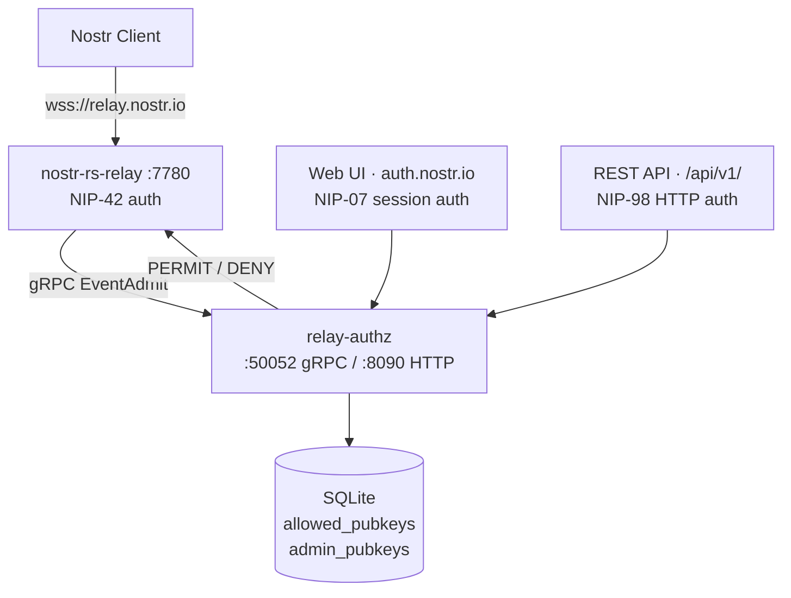

# relay.nostr.io Deployment and Operations

An authenticated Nostr relay system consisting of two components: **nostr-rs-relay** (the WebSocket relay enforcing NIP-42 auth) and **relay-authz** (a Go sidecar providing gRPC event admission and an HTTP admin interface for managing the pubkey allow list).

Source: `https://github.com/Buildtall-Systems/relay.nostr.io`

## System Overview



**Write path**: Client publishes event to relay. Relay extracts NIP-42 authenticated pubkey, calls gRPC `EventAdmit` on sidecar. Sidecar checks `allowed_pubkeys` table, returns PERMIT or DENY.

**Admin path**: Administrators manage the allow list through the web UI (NIP-07 browser extension auth) or REST API (NIP-98 signed HTTP requests). Both require the caller's pubkey to be in the `admin_pubkeys` table.

## When to Use This Skill

- Deploying relay.nostr.io to a fresh Ubuntu server from scratch
- Building the relay-authz binary from source
- Configuring nginx reverse proxy and TLS certificates
- Setting up systemd services for the relay and sidecar
- Seeding initial admin npubs
- Adding or removing npubs from the allow list via API
- Troubleshooting relay authentication or authorization issues

## Reference Documents

Detailed procedures are in `references/`. Load as needed based on task:

| Document | Contents | When to Load |
|----------|----------|--------------|
| [build-and-deploy.md](references/build-and-deploy.md) | Prerequisites, building from source, nginx config, certbot, systemd units, full deployment walkthrough | Setting up a new server or rebuilding |
| [api-usage.md](references/api-usage.md) | NIP-98 auth construction, all REST endpoints with nak/curl examples, NIP-42 relay publishing | Managing the allow list programmatically |
| [admin-and-web-ui.md](references/admin-and-web-ui.md) | Admin seeding, NIP-07 web UI auth flow, dashboard operations, admin management | Setting up admins or using the web interface |

## Quick Reference

### Port Allocation

| Service | Port | Binding | Public URL |
|---------|------|---------|------------|
| nostr-rs-relay | 7780 | 0.0.0.0 | wss://relay.nostr.io |
| relay-authz gRPC | 50052 | [::1] | (internal) |
| relay-authz HTTP | 8090 | 127.0.0.1 | https://auth.nostr.io |

### File System Layout

| Path | Purpose |
|------|---------|
| `/usr/local/bin/relay-authz` | Sidecar binary |
| `/usr/local/bin/nostr-rs-relay` | Relay binary |
| `/etc/relay.nostr.io/authz.toml` | Sidecar config |
| `/etc/relay.nostr.io/config.relay.toml` | Relay config |
| `/var/lib/relay.nostr.io/` | Data directory (SQLite DBs, static assets) |

### Key Operations (nak)

Add an npub to the allow list:

```bash
NIP98=$(nak event --sec <admin-nsec> -k 27235 -c "" \
  --tag u="https://auth.nostr.io/api/v1/pubkeys" --tag method=POST)
curl -s -X POST "https://auth.nostr.io/api/v1/pubkeys" \
  -H "Authorization: Nostr $(echo -n "$NIP98" | base64 -w0)" \
  -H "Content-Type: application/json" \
  -d '{"npub":"npub1...","note":"description"}' | jq .
```

Publish to the relay:

```bash
nak event --sec <nsec> -c "Hello" --auth wss://relay.nostr.io
```

For complete API reference with all endpoints and options, load [references/api-usage.md](references/api-usage.md).
